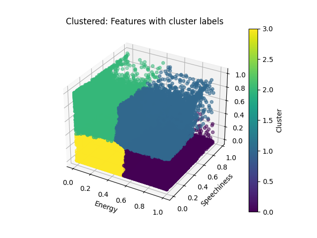
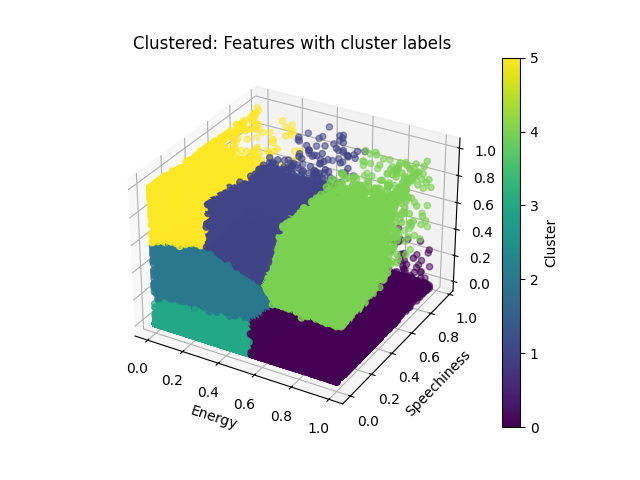

# Spotify Visualizer

## How to Run

Note: We defaulted the setup on this repository to validate each implementation against the serial one. Because of the need for _random_ initialization in the k clusters, and the variable number of epochs and clusters, we run the serial and then execute whatever function you are using. For example, when running the single GPU implementation, we execute `main.cu` which runs the implementation serially, then the GPU implementation, so that the data can be validated.

### Serial CPU

Note: We implicity run the serial implementation for every other one as comparison. However, if you would like to run it standalone:

```bash
g++ serial-only.cpp -o serial
./serial 25 6
```

To change the number of epochs and clusters, pass in different values as arguments to the command.
`./serial <number of epochs> <number of clusters>`

### Parallel CPU

```bash
g++ -fopenmp serial-to-parallel.cpp -o parallel
./parallel 25 6 8
```

To change the number of epochs, clusters and threads, pass in different values as arguments to the command.
`./parallel <number of epochs> <number of clusters> <optional: number of threads>`

If you do not pass in a threadcount, it will default to 4 threads.

### Distributed CPU

Running on CHPC first we need to load the module:

```bash
module load openmpi
```

When running this, you need to pass in two arguments: the number of epochs and the number of clusters. For example, to run 25 epochs with 6 clusters:

```bash
mpic++ serial-to-distributed-cpu.cpp -o distributed
mpirun -np 2 ./distributed 25 6
```

To change the number of epochs and clusters, pass in different values as arguments to the command.

`mpirun -np <number of nodes> ./distributed <number of epochs> <number of clusters>`

### Parallel GPU

Running on CHPC first we need to load the module:

```bash
module load cuda/12
```

Now we can compile and execute:

```bash
nvcc serial-to-single-gpu.cu -o gpu
./gpu 25 6
```

To change the number of epochs and clusters, pass in different values as arguments to the command.
`./gpu <number of epochs> <number of clusters>`

### Distributed GPU

First we setup our CHPC environment to have N nodes and each node to have a GPU. Next, we load our modules:

```bash
module load cuda/12
module load openmpi
```

Now we can compile and execute, but we need to compile the files separately and then join them together:

Path to where CUDA is installed

```bash
echo $CUDA_PATH # gets the path to where cuda is

```

Your path could be different, but it will be similar to this on the CHPC system:

```bash
/uufs/chpc.utah.edu/sys/installdir/r8/cuda/12.2.0/
```

Then we append `lib64` to the end of that path:

```bash
/uufs/chpc.utah.edu/sys/installdir/r8/cuda/12.2.0/lib64
```

Now we can compile and execute:

```bash
nvcc -c distributedGPU.cu
mpicxx -o dist serial-to-distributed-gpu.cpp distributedGPU.o -L/uufs/chpc.utah.edu/sys/installdir/r8/cuda/12.2.0/lib64 -lcudart -lcuda
mpirun -np 2 ./dist 25 6
```

To change the number of epochs and clusters, pass in different values as arguments to the command.

`mpirun -np <number of nodes> ./distributed <number of epochs> <number of clusters>`

### Running the Python Visualization

First, edit the file `visualize.py` to point to the correct csv files you would like to visualize.

Now, run the following commands from the project root directory:

```bash
pip install -r requirements.txt
python3 visualize.py
```

## Validation

In serial.hpp we wrote a function, `areFilesEqual`, to validate two csv files against eachother. It will return true if the are, false if not. We will check every file against the ground truth, defined by the serial implementation. If we pass in the variable true after the thread names, it will print out the first 5 differences between the files and print the total number of differences.

To simplify grading and validation, we built into every implementation a function call to `performSerial` this allows the specific number of epochs and clusters to be run serially, and in the implementation. We also wrote the function `areFilesEqual` to compare the output of the serial implementation to the output of the implementation being tested.

## Our Approaches

We chose to use 3,4, and 6 as our testing values for the clusters because we wanted to see how well the program would change going in doubling the cluster size (3 to 6), and also to see how only changing one (3 to 4) would affect our outcomes. We ran all of the programs several times to ensure accuracy in timing and outputs.

<!-- TODO: Add data and visualization for each implementation using clusters of sizes 3 4 and 6 -->

### Serial Implementation

For the serial implementation we used the link provided by Dr. Petruzza [here](http://reasonabledeviations.com/2019/10/02/k-means-in-cpp/). We added onto this the z variable into both the Point3D value and how we update the clusters at the end of each epoch. We implemented the actual serial code in `serial.cpp` and the commonly used code across all implementations in `serial.hpp`. Fundamentally, this works by taking in X number of points and K randomized clusters. Every point is then assigned to a cluster based on how close it is. The clusters are then updated to reflect their nearest points, the average of the groupings, and then we run this entire process for a specified number of iterations, denoted as `epochs` in the code.

### Single GPU Implementation

For the GPU implementation we took our serial implementation and changed as little as possible to preserve code modularity, but we did create a kMeansClustering kernel that takes in the data, clusters, and epochs and performs the kMeansClustering algorithm. We also create an on device function calculateDistance to easily calculate the distance between two points.

The most important thing to get right in this implementation was the memory management. We needed to allocate memory for the data, clusters, and distances. We also needed to copy the data and clusters to the device, and copy the clusters back to the host after each epoch. Keeping track of the the thread we were on within the kernel was also important, because we needed to know which cluster to update. The slowest part of this implementation was copying the data and clusters back and forth between the host and device, because we have to do that for each epoch in order to consolidate data and then fix upon completion.

### Parallel CPU Implementation

For the parallel CPU implementation we took our serial implementation and changed it to use Open MP. As with the GPU paralleization, the main consideration we had was on the nested loops iterating over every point. This was the loop we parallelized, allowing each thread to use a chunk of the total number of points (1,240,425). In the case of 5 threads, each thread works on 1240425/5 = 248085 points. We let OpenMP handle the distribution of the points across each thread. After each thread is completed, we need to update the clusters, which is done by the master thread, then restart the loop for the next epoch, once again distributing points among the threads.

### Distributed CPU Implementation

For the distributed CPU implementation we wanted to be able to use as much code as possible from the serial implementation, but MPI required us to pass arrays around rather than points. This required rewriting the shared functions and creating our own distributed version called `calculateKMean` and `updateCnetroidDataDistributed`.They take in arrays of clusters, denoted with k's and arrays of the data points. Each process has its own chunk of data it is working on, called recv_x recv_y and recv_z. Each process handles their subset of the points and compares it against the clusters. After each process is done, we need to update the clusters, then restart the loop for the next epoch, and then broadcast the updated clusters to all processes.

To ensure the data could be distributed across any number of processors we used ScatterV to distribute the data and allowed each process to only work on its specified points. We had process 0 handle the serial implementation at the beginning and the comparison of points at the end to validate accuracy.

### Distributed GPU Implementation

For the distributed GPU implementation, we took the code from our distributed CPU implementation and create the `distributedGPU.cu` file to run the GPU code. We wrote the `launchCalculateMean` function to launch the kernel and to also be accessible to outside files (needed for a distributed GPU). Everything else in the distributed GPU is the same as distributed CPU, besides that specific function call.

When we are running `launchCalculateMean` we allocate memory for the particular node's data points and the centroids. It runs the k-means clustering algorithm on the GPU, then copies the updated associations which are on teh reference from the GPU to the CPU. At this point we are back into the distributed system and use gatherV to bring these updated centroids and their associated points together. This whole process is repeated for each epoch.

We had trouble initially with the distributed GPU implementation because we were not allocating enough memory on the GPU to complete its required tasks. We diagnosed the issue using our `checkCUDAError` function and found that we were running out of memory on the GPU for our specific data points. We realized we had been using mismatched points, and after fixing that we were able to run the distributed GPU implementation.

## Analysis

In the data set there are 1240425 points, and the amount of data processed is equal to epochs \* numPoints. So for 100 epochs, we process 124042500 points. For 200 epochs, we process all of those points 200 times (248085000), etc.

### Unprocessed Data


### Serial Implementation

| Time (s)  | Epochs | Clusters |
| --------- | ------ | -------- |
| 9.807173  | 50     | 3        |
| 12.552126 | 50     | 4        |
| 17.976485 | 50     | 6        |
| 19.570529 | 100    | 3        |
| 25.194927 | 100    | 4        |
| 35.975967 | 100    | 6        |
| 38.853329 | 200    | 3        |
| 50.216369 | 200    | 4        |
| 72.608509 | 200    | 6        |

Output for 4 Clusters:



Serial Implementation Visualized with 6 Clusters:


Serial Implementation Visualized with 12 Clusters:


### Single GPU Implementation

#### Device Details from Cuda Query

We are looking at the following GPU:

```text
Device 0: "NVIDIA GeForce RTX 3090"
  Major revision number:                         8
  Minor revision number:                         6
  Total amount of global memory:                 3963289600 bytes
  Number of multiprocessors:                     82
  Number of cores:                               656
  Total amount of constant memory:               65536 bytes
  Total amount of shared memory per block:       49152 bytes
  Total number of registers available per block: 65536
  Warp size:                                     32
  Maximum number of threads per block:           1024
  Maximum sizes of each dimension of a block:    1024 x 1024 x 64
  Maximum sizes of each dimension of a grid:     2147483647 x 65535 x 65535
  Maximum memory pitch:                          2147483647 bytes
  Texture alignment:                             512 bytes
  Clock rate:                                    1.70 GHz
  Concurrent copy and execution:                 Yes
```

Becuase it can have 1024 threads per block, we will use that as our baseline. It has 82 multiprocesors, and ideally we hit our maximum number of threads and use all of the multiprocessors.

#### Experimental Results

<!-- TODO Insert the single gpu data from tables.md -->

Single GPU Implementation Visualized with 6 Clusters:


Single GPU Implementation Visualized with 12 Clusters:


### Parallel CPU Implementation

<!-- TODO Insert the parallel CPU data from tables.md -->

Parallel CPU Implementation Visualized with 6 Clusters:


### Distributed CPU Implementation

On 3 clusters:

| Nodes | Time (s) | Time Serial (s) | Epochs | Clusters |
| ----- | -------- | --------------- | ------ | -------- |
| 2     | 0.766036 | 4.811508        | 25     | 3        |
| 3     | 0.621373 | 4.827385        | 25     | 3        |
| 4     | 0.581396 | 4.842869        | 25     | 3        |

On 4 clusters:

| Nodes | Time (s) | Time Serial (s) | Epochs | Clusters |
| ----- | -------- | --------------- | ------ | -------- |
| 2     | 0.947897 | 6.203727        | 25     | 4        |
| 3     | 0.739652 | 6.202104        | 25     | 4        |
| 4     | 0.670900 | 6.228862        | 25     | 4        |

On 6 Clusters:

| Nodes | Parallel Time (s) | Time Serial (s) | Epochs | Clusters |
| ----- | ----------------- | --------------- | ------ | -------- |
| 2     | 1.245606          | 8.818218        | 25     | 6        |
| 3     | 0.942043          | 8.863819        | 25     | 6        |
| 4     | 0.819143          | 8.859402        | 25     | 6        |

Notice how the parallel time is going down as we increase the number of nodes. This breaks up the amount of data to process per node and allows us to process the data faster.

Now with 4 nodes but scaling up the number of epochs and the amount of data:

| Nodes | Parallel Time (s) | Time Serial (s) | Epochs | Clusters |
| ----- | ----------------- | --------------- | ------ | -------- |
| 4     | 0.820076          | 8.816901        | 25     | 6        |
| 4     | 1.595893          | 17.698479       | 50     | 6        |
| 4     | 3.121529          | 35.421519       | 100    | 6        |
| 4     | 6.180246          | 70.824262       | 200    | 6        |

A visualized example of the distributed CPU implementation with 4 nodes and 50 epochs:


### Distributed GPU Implementation

<!-- TODO: Add information from tables.md for distributed GPU -->

Figure of the distributed GPU implementation with 6 nodes and 100 epochs:


## References

- [Initial Setup](http://reasonabledeviations.com/2019/10/02/k-means-in-cpp/)
- [K-Means Clustering](https://en.wikipedia.org/wiki/K-means_clustering)
- [Paper on K-Means](https://arxiv.org/pdf/2203.01081.pdf)
- [Distributed GPUs](https://docs.ccv.brown.edu/oscar/gpu-computing/mpi-cuda)
