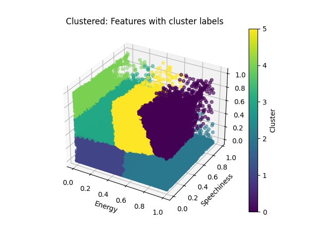
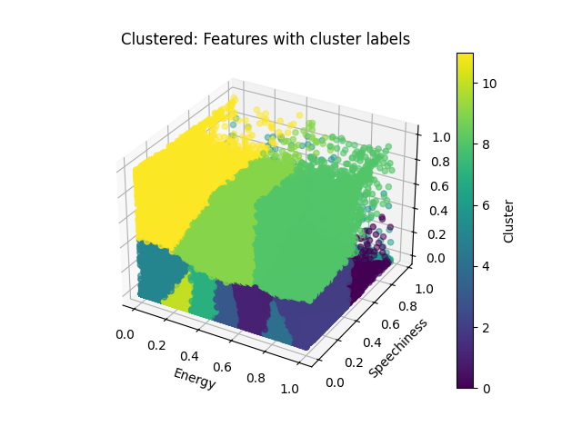
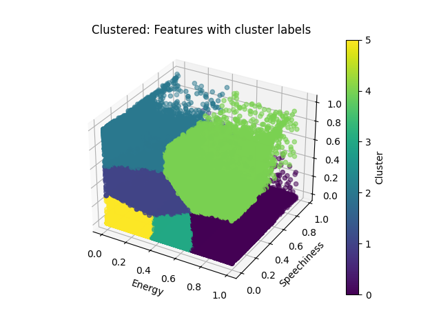
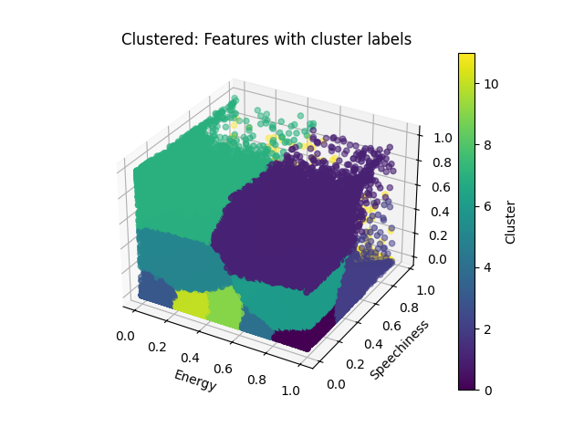

# Spotify Visualizer

## How to Run

We defaulted the setup on this repository to validate each implementation against the serial one. Because of the need for _random_ initialization in the k clusters, we need to share data depending on the number of clusters and epochs selected. To do this, we setup several files to compare against the serial implementation. For example, when running the single GPU implementation, we execute `main.cu` which runs the implementation serially, then the GPU implementation, so that the data can be validated.

### Serial CPU

Note: We implicity run the serial implementation for every other one as comparison. However, if you would like to run it standalone:

Uncomment the main function at the bottom of `serial.cpp`, and then run the following in the terminal:

```bash
g++ serial.cpp -o serial
./serial
```

### Parallel CPU

### Distributed CPU

### Parallel GPU

Running on CHPC first we need to load the module:

```bash
module load cuda/12
```

Now we can compile and execute:

```bash
nvcc main.cu -o main
./main
```

### Distributed GPU

## Validation

In serial.hpp we wrote a function, areFilesEqual, to validate two csv files against eachother. It will return true if the are, false if not. We will check every file against the ground truth, defined by the serial implementation.

In order to test the truth we need to compare two sets of data, however, to properly do the kmeans algorithm we randomly initalize data points and then take the average of each point from the input data and these random points.

Because of the randomness inherent to the K-means algorithm, and the varying number of clusters and epochs, we need to generate the initial set of data based on clusters and epochs, then share that data between serial CPU and the other implementations.

However, to still show that the algorithm is working, we tested both the CPU and GPU implementations against eachother _without_ the random initaliztion, which does give the same output between the implementations, but it does not do a true k-means algorithm.

## Running the Python Visualization

First, edit the file `visualize.py` to point to the correct csv files you would like to visualize.

Now, run the following commands from the project root directory:

```bash
pip install -r requirements.txt
python3 visualize.py
```

## Analysis

### Unprocessed Data


### Serial Implementation

| NumPoints | Time (s)  | Epochs | Clusters |
| --------- | --------- | ------ | -------- |
| 1240425   | 25.816402 | 100    | 6        |
| 1240425   | 48.143714 | 100    | 12       |
| 1240425   | 52.172065 | 200    | 6        |
| 1240425   | 95.354178 | 200    | 12       |

Serial Implementation Visualized with 6 Clusters:



Serial Implementation Visualized with 12 Clusters:



### Single GPU Implementation

#### Device Details from Cuda Query

```text
Device 0: "Tesla T4"
  Major revision number:                         7
  Minor revision number:                         5
  Total amount of global memory:                 2770927616 bytes
  Number of multiprocessors:                     40
  Number of cores:                               320
  Total amount of constant memory:               65536 bytes
  Total amount of shared memory per block:       49152 bytes
  Total number of registers available per block: 65536
  Warp size:                                     32
  Maximum number of threads per block:           1024
  Maximum sizes of each dimension of a block:    1024 x 1024 x 64
  Maximum sizes of each dimension of a grid:     2147483647 x 65535 x 65535
  Maximum memory pitch:                          2147483647 bytes
  Texture alignment:                             512 bytes
  Clock rate:                                    1.59 GHz
  Concurrent copy and execution:                 Yes

```

| NumPoints | Time (s)  | Epochs | Clusters | Threads per Block | Blocks per Grid |
| --------- | --------- | ------ | -------- | ----------------- | --------------- |
| 1240425   | 6.171497  | 100    | 6        | 256               | 4704            |
| 1240425   | 11.557186 | 200    | 6        | 256               | 4704            |
| 1240425   | 5.903793  | 100    | 12       | 256               | 4704            |
| 1240425   | 11.755927 | 200    | 12       | 256               | 4704            |
| 1240425   | 35.562620 | 600    | 12       | 256               | 4704            |
| 1240425   | 70.860667 | 1200   | 12       | 256               | 4704            |

As you can see, compared to the serial implentation this is significantly faster. For 200 epochs on 12 clusters it took roughly 1/9th of the time.

This also shows that this algorithm is strongly scalable, because as we increase the epochs (which is a multiplier on the data we use), the time increases proportionally.

We can also change the number of threads per block to fully use the number of threads per block.

| NumPoints | Time(s)   | Epochs | Clusters | Threads per Block | Blocks per Grid |
| --------- | --------- | ------ | -------- | ----------------- | --------------- |
| 1240425   | 6.224101  | 100    | 12       | 1024              | 1176            |
| 1240425   | 11.819179 | 200    | 12       | 1024              | 1176            |
| 1240425   | 35.537325 | 600    | 12       | 1024              | 1176            |
| 1240425   | 70.771222 | 1200   | 12       | 1024              | 1176            |

As shown here above, fully using the threads per block did not make any noticeable speedup in the compuation. All values are within .3 seconds of their computation at 256 threads per block.

Single GPU Implementation Visualized with 6 Clusters:



Single GPU Implementation Visualized with 12 Clusters:


