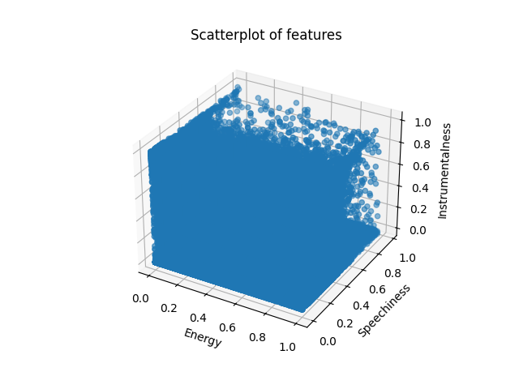

# Spotify Visualizer

## How to Run

We defaulted the setup on this repository to validate each implementation against the serial one. Because of the need for _random_ initialization in the k clusters, we need to share data depending on the number of clusters and epochs selected. To do this, we setup several files to compare against the serial implementation. For example, when running the single GPU implementation, we execute `main.cu` which runs the implementation serially, then the GPU implementation, so that the data can be validated.

### Serial CPU

Note: We implicity run the serial implementation for every other one as comparison. However, if you would like to run it standalone:

```bash
g++ serial-only.cpp -o serial
./serial
```

To change the number of epochs and clusters, edit the `main` function in `serial-only.cpp`.

### Parallel CPU

```bash
g++ -fopenmp serial-to-parallel.cpp -o parallel
./parallel
```

To change the number of epochs and clusters, edit the `main` function in `serial-to-parallel.cpp`.

### Distributed CPU

Running on CHPC first we need to load the module:

```bash
module load openmpi
```

When running this, you need to pass in two arguments: the number of epochs and the number of clusters. For example, to run 25 epochs with 6 clusters:

```bash
mpic++ serial-to-distributed-cpu.cpp -o distributed
mpirun -np 2 ./distributed 25 6
```

### Parallel GPU

Running on CHPC first we need to load the module:

```bash
module load cuda/12
```

Now we can compile and execute:

```bash
nvcc serial-to-single-gpu.cu -o gpu
./gpu
```

To change the number of epochs and clusters, edit the `main` function in `serial-to-single-gpu.cu`.

### Distributed GPU

## Validation

In serial.hpp we wrote a function, areFilesEqual, to validate two csv files against eachother. It will return true if the are, false if not. We will check every file against the ground truth, defined by the serial implementation.

To simplify grading and validation, we built into every implementation a function call to `performSerial` this allows the specific number of epochs and clusters to be run serially, and in the implementation. We also wrote the function `areFilesEqual` to compare the output of the serial implementation to the output of the implementation being tested.

## Running the Python Visualization

First, edit the file `visualize.py` to point to the correct csv files you would like to visualize.

Now, run the following commands from the project root directory:

```bash
pip install -r requirements.txt
python3 visualize.py
```

## Analysis

In the data set there are 1240425 points, and the amount of data processed is equal to epochs \* numPoints. So for 100 epochs, we process 124042500 points. For 200 epochs, we process all of those points 200 times (248085000), etc.

### Unprocessed Data



### Serial Implementation

| Time (s)  | Epochs | Clusters |
| --------- | ------ | -------- |
| 25.816402 | 100    | 6        |
| 48.143714 | 100    | 12       |
| 52.172065 | 200    | 6        |
| 95.354178 | 200    | 12       |

Serial Implementation Visualized with 6 Clusters:


Serial Implementation Visualized with 12 Clusters:


### Single GPU Implementation

#### Device Details from Cuda Query

```text
Device 0: "Tesla T4"
  Major revision number:                         7
  Minor revision number:                         5
  Total amount of global memory:                 2770927616 bytes
  Number of multiprocessors:                     40
  Number of cores:                               320
  Total amount of constant memory:               65536 bytes
  Total amount of shared memory per block:       49152 bytes
  Total number of registers available per block: 65536
  Warp size:                                     32
  Maximum number of threads per block:           1024
  Maximum sizes of each dimension of a block:    1024 x 1024 x 64
  Maximum sizes of each dimension of a grid:     2147483647 x 65535 x 65535
  Maximum memory pitch:                          2147483647 bytes
  Texture alignment:                             512 bytes
  Clock rate:                                    1.59 GHz
  Concurrent copy and execution:                 Yes

```

<!-- TODO Check whether this is strongly scalable and/or weakly scalable -->

| Time (s)  | Epochs | Clusters | Threads per Block | Blocks per Grid |
| --------- | ------ | -------- | ----------------- | --------------- |
| 6.171497  | 100    | 6        | 256               | 4704            |
| 11.557186 | 200    | 6        | 256               | 4704            |
| 5.903793  | 100    | 12       | 256               | 4704            |
| 11.755927 | 200    | 12       | 256               | 4704            |
| 35.562620 | 600    | 12       | 256               | 4704            |
| 70.860667 | 1200   | 12       | 256               | 4704            |

As you can see, compared to the serial implentation this is significantly faster. For 200 epochs on 12 clusters it took roughly 1/9th of the time.

This also shows that this algorithm is strongly scalable, because as we increase the epochs (which is a multiplier on the data we use), the time increases proportionally.

We can also change the number of threads per block to fully use the number of threads per block.

<!-- TODO Check whether this is strongly scalable and/or weakly scalable -->

| Time(s)   | Epochs | Clusters | Threads per Block | Blocks per Grid |
| --------- | ------ | -------- | ----------------- | --------------- |
| 6.224101  | 100    | 12       | 1024              | 1176            |
| 11.819179 | 200    | 12       | 1024              | 1176            |
| 35.537325 | 600    | 12       | 1024              | 1176            |
| 70.771222 | 1200   | 12       | 1024              | 1176            |

As shown here above, fully using the threads per block did not make any noticeable speedup in the compuation. All values are within .3 seconds of their computation at 256 threads per block.

Single GPU Implementation Visualized with 6 Clusters:


Single GPU Implementation Visualized with 12 Clusters:


### Parallel CPU Implementation

This table displays scaling with an increasing number of threads while keeping the amount of data the same.

| Threads | Time (s)  | Epochs | Clusters |
| ------- | --------- | ------ | -------- |
| 4       | 27.579025 | 100    | 6        |
| 8       | 28.141354 | 100    | 6        |
| 12      | 27.901411 | 100    | 6        |
| 16      | 30.336343 | 100    | 6        |
| 24      | 29.499232 | 100    | 6        |

This table displays scaling the data keeping the number of threads the same, but increasing the amount of data (number of epochs).

| Threads | Time (s)   | Epochs | Clusters |
| ------- | ---------- | ------ | -------- |
| 12      | 27.901411  | 100    | 6        |
| 12      | 61.109881  | 200    | 6        |
| 12      | 124.803791 | 400    | 6        |
| 12      | 249.964666 | 800    | 6        |

<!-- TODO Check whether this is strongly scalable and/or weakly scalable -->

This data tells us that this is not a strongly scalable algorithm, because as we increase the number of threads, the time does not decrease. However, as we increase the amount of data, the time does increase proportionally.

Parallel CPU Implementation Visualized with 6 Clusters:


### Distributed CPU

This table displays scaling with an increasing number of nodes while keeping the amount of data the same.

| Nodes | Time (s) | Epochs | Clusters |
| ----- | -------- | ------ | -------- |
| 2     | 1.180753 | 25     | 4        |
| 3     | .935105  | 25     | 4        |
| 4     | .789611  | 25     | 4        |

Now with 100 epochs and 6 clusters:

| Nodes | Parallel Time (s) | Serial Time | Epochs | Clusters |
| ----- | ----------------- | ----------- | ------ | -------- |
| 2     | 6.442704          | 25.327500   | 100    | 6        |
| 3     | 4.587259          | 25.238905   | 100    | 6        |
| 4     | 3.824345          | 25.277028   | 100    | 6        |

Notice how the parallel time is going down as we increase the number of nodes. This breaks up the amount of data to process per node and allows us to process the data faster.

Now with 4 nodes but scaling up the number of epochs and the amount of data:

| Nodes | Parallel Time (s) | Serial Time (s) | Epochs | Clusters |
| ----- | ----------------- | --------------- | ------ | -------- |
| 4     | 1.919520          | 12.649348       | 50     | 6        |
| 4     | 3.824345          | 25.277028       | 100    | 6        |
| 4     | 7.531646          | 50.564563       | 200    | 6        |
| 4     | 15.114408         | 10.1182546      | 400    | 6        |

### Distributed GPU

## References

- [K-Means Clustering](https://en.wikipedia.org/wiki/K-means_clustering)
- [Example 1](https://arxiv.org/pdf/2203.01081.pdf)
- [Lectures](https://cse.buffalo.edu/faculty/miller/Courses/CSE633/Gautam-Shende-Spring-2018.pdf)
